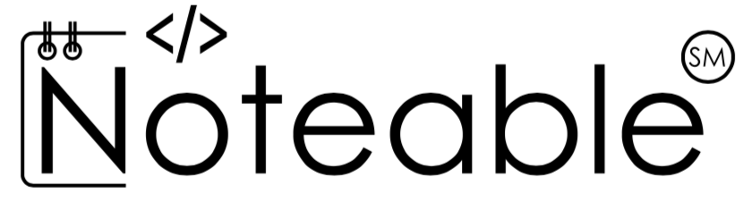

exclude: true

```{r, message=FALSE, warning=FALSE, include=FALSE}
options(
  htmltools.dir.version = FALSE, # for blogdown
  width=80
)

```

---
class: middle, center

# Course Details

---

## Course website

<br/><br/><br/><br/>

.center[
**Learn** - https://learn.ed.ac.uk
<br/><br/>
and/or
<br/><br/>
https://statprog-s1-2019.github.io
]

---

## Reproducible Research / Computing

* R + RStudio + rmarkdown

* Git + github

--

<br/>

.center[
*Programming course with statistics*

vs.

*Statistics course with programming*
]


---

## Weekly Schedule

* Mondays, 16:10 - 18:00
  - Lecture

* Thursday, ??? - ???
  - Workshop
  
---

## Marking

<br/>

.center[

|Assignment|Type      |Value|Assigned   |
|:---------|:---------|:----|---------- |
|Homework 1|Team      |10%  |Out Week 2 |
|Homework 2|Team      |10%  |Out Week 4 |
|Project 1 |Individual|30%  |Out Week 5 |
|Homework 3|Team      |10%  |Out Week 7 |
|Homework 4|Team      |10%  |Out Week 9 |
|Project 2 |Individual|30%  |Out Week 10|

]

---

## Teams

* Team homework assignments
    + Roughly biweekly assignments
    + Open ended
    + 5 - 20 hours of work
    + Peer evaluation at the end

<br/>

* Expectations and roles
    + Everyone is expected to contribute equal *effort*
    + Everyone is expected to understand *all* code turned in
    + Individual contribution evaluated by peer evaluation, commits, etc.

---

## Collaboration policy


- Only work that is clearly assigned as team work should be completed collaboratively (Homework). 

- On projects you may not directly share or discuss code with anyone other than the Instructors and Tutors

- On homeworks you may not directly share code with other team(s) in this class, however you are welcome to discuss the problems together and ask for advice


---

## Sharing / reusing code policy

- I am well aware that a huge volume of code is available on the web to solve any number of problems.

- Unless I explicitly tell you not to use something the course's policy is that you may make use of any online resources (e.g. Google, StackOverflow, etc.) but you must explicitly cite where you obtained any code you directly use (or use as inspiration). 

- Any recycled code that is discovered and is not explicitly cited will be treated as plagiarism. 

---

## Noteable / RStudio

<br/><br/>

.center[
```{r echo=FALSE, out.width="50%"}

```

<br/><br/>

```{r echo=FALSE, out.width="50%"}
knitr::include_graphics("imgs/RStudio-Logo.png")
```
]

<br/>

Login via the link on the left-side menu in Learn.


---
class: middle
count: false

# In R (almost) <br/> everything is a vector

---

## Vectors

The fundamental building block of data in R are vectors (collections of related values, objects, data structures, functions, etc).

--
<br/>

R has two types of vectors:

* **atomic** vectors 

    - homogeneous collections of the *same* type (e.g. all `true`/`false` values, all numbers, or all character strings).

* **generic** vectors
  
    - heterogeneous collections of *any* type of R object, even other lists (meaning they can have a hierarchical/tree-like structure).

---
class: middle
count: false

# Atomic Vectors

---

## Atomic Vectors

R has six atomic vector types: 

<br/>

  `typeof`  |  `mode`     
:-----------|:------------
logical     |  logical    
double      |  numeric    
integer     |  numeric    
character   |  character  
complex     |  complex    
raw         |  raw        

---

## Vector types

`logical` - boolean values `TRUE` and `FALSE`

.pull-left[
```{r}
typeof(TRUE)
```
]

.pull-right[
```{r}
mode(TRUE)
```
]

<br/>

`character` - text strings

<div>

.pull-left[
```{r}
typeof("hello")
typeof('world')
```
]

.pull-right[
```{r}
mode("hello")
mode('world')
```
]

</div>

---

`double` - floating point numerical values (default numerical type)

.pull-left[
```{r}
typeof(1.33)
typeof(7)
```
]

.pull-right[
```{r}
mode(1.33)
mode(7)
```
]

<br/>

`integer` - integer numerical values (indicated with an `L`)

<div>

.pull-left[
```{r}
typeof( 7L )
typeof( 1:3 )
```
]

.pull-right[
```{r}
mode( 7L )
mode( 1:3 )
```
]

</div>

---

## Concatenation

Atomic vectors can be constructed using the concatenate, `c()`, function.

```{r}
c(1,2,3)
```

--

```{r}
c("Hello", "World!")
```

--

```{r}
c(1, 1:10)
```

--

```{r}
c(1,c(2, c(3)))
```

**Note** - atomic vectors are *always* flat.

---
class: split-thirds

## Inspecting types

* `typeof(x)` - returns a character vector (length 1) of the *type* of object `x`.

* `mode(x)` - returns a character vector (length 1) of the *mode* of object `x`.


.pull-left[
```{r}
typeof(1)
typeof(1L)
typeof("A")
typeof(TRUE)
```
]

.pull-right[
```{r}
mode(1)
mode(1L)
mode("A")
mode(TRUE)
```
]

---

## Type Predicates

* `is.logical(x)` - returns `TRUE` if `x` has *type* logical.

* `is.character(x)` - returns `TRUE` if `x` has *type* character.

* `is.double(x)` - returns `TRUE` if `x` has *type* double.

* `is.integer(x)` - returns `TRUE` if `x` has *type* integer.

* `is.numeric(x)` - returns `TRUE` if `x` has *mode* numeric.

.col1[
```{r}
is.integer(1)
is.integer(1L)
is.integer(3:7)
```
]

.col2[
```{r}
is.double(1)
is.double(1L)
is.double(3:8)
```
]

.col3[
```{r}
is.numeric(1)
is.numeric(1L)
is.numeric(3:7)
```
]


---

## Other useful predicates

* `is.atomic(x)` - returns `TRUE` if `x` is an *atomic vector*.

* `is.vector(x)` - returns `TRUE` if `x` is either an *atomic vector* or *list*.

```{r}
is.atomic(c(1,2,3))
is.vector(c(1,2,3))
is.atomic(list(1,2,3))
is.vector(list(1,2,3))
```


---

## Type Coercion

R is a dynamically typed language -- it will automatically convert between most types without raising warnings or errors.

```{r}
c(1,"Hello")
```

--

```{r}
c(FALSE, 3L)
```

--

```{r}
c(1.2, 3L)
```

---

## Operator coercion

Functions and operators will attempt to coerce object to an appropriate type

```{r}
3.1+1L
```

--

```{r}
log(TRUE)
```

--

```{r}
TRUE & 7
```

--

```{r}
FALSE | !5
```


---

## Explicit Coercion

Most of the `is` functions we just saw have an `as` variant which can be used for *explicit* coercion.

.pull-left[
```{r}
as.logical(5.2)
as.character(TRUE)
as.integer(pi)
```
]

.pull-right[
```{r}
as.numeric(FALSE)
as.double("7.2")
as.double("one")
```
]

---
count: false
class: middle

# Conditionals

---

## Logical (boolean) operators

<br/><br/>

|  Operator                     |  Operation    |  Vectorized? 
|:-----------------------------:|:-------------:|:------------:
| <code>x &#124; y</code>       |  or           |   Yes        
| `x & y`                       |  and          |   Yes        
| `!x`                          |  not          |   Yes        
| <code>x &#124;&#124; y</code> |  or           |   No         
| `x && y`                      |  and          |   No         
|`xor(x,y)`                     |  exclusive or |   Yes        


---

## Vectorized?

```{r}
x = c(TRUE,FALSE,TRUE)
y = c(FALSE,TRUE,TRUE)
```

.pull-left[
```{r}
x | y
x || y
```
]

.pull-right[
```{r}
x & y
x && y
```
]

---

## Vectorization and arithmatic

Almost all of the basic mathematical operations (and many other functions) in R are vectorized as well.

.pull-left[
```{r}
c(1,2,3) + c(3,2,1)
c(1,2,3) / c(3,2,1)
```
]

.pull-right[
```{r}
log(c(1, 3, 0))
sin(c(1,2,3))
```
]


---

## Length coercion

```{r}
x = c(TRUE,FALSE,TRUE)
y = c(TRUE)
z = c(FALSE,TRUE)
```

--

.pull-left[
```{r}
x | y
x & y
```
]

--

.pull-right[
```{r}
y | z
y & z
```
]

--

```{r}
x | z
```

---

## Comparisons

  Operator  |  Comparison                |  Vectorized?
:----------:|:--------------------------:|:----------------:
 `x < y`    |  less than                 |  Yes
 `x > y`    |  greater than              |  Yes
 `x <= y`   |  less than or equal to     |  Yes
 `x >= y`   |  greater than or equal to  |  Yes
 `x != y`   |  not equal to              |  Yes
 `x == y`   |  equal to                  |  Yes
 `x %in% y` |  contains                  |  Yes (over `x`)


---

## Comparisons

```{r}
x = c("A","B","C")
z = c("A")
```

.pull-left[
```{r}
x == z
x != z
x > z
```
]

--

.pull-right[
```{r}
x %in% z
z %in% x
```
]
 

---

## Conditional Control Flow

Conditional execution of code blocks is achieved via `if` statements. 

```{r}
x = c(1,3)
```

--

```{r}
if (3 %in% x)
  print("This!")
```

--

```{r}
if (1 %in% x)
  print("That!")
```

--

```{r}
if (5 %in% x)
  print("Other!")
```


---

## Note `if` is not vectorized

```{r}
x = c(1,3)
```

--

```{r}
if (x %in% 3)
  print("Now Here!")
```

--

```{r}
if (x %in% 1)
  print("Now Here!")
```


---

## Collapsing logical vectors

There are a couple of helper functions for collapsing a logical vector down to a single value: `any`, `all`

```{r}
x = c(3,4,1)
```

.pull-left[
```{r}
x >= 2
any(x >= 2)
all(x >= 2)
```
]

.pull-right[
```{r}
x <= 4
any(x <= 4)
all(x <= 4)
```
]


---

## Nesting Conditionals

.pull-left[
```{r}
x = 3
if (x < 0) {
  "Negative"
} else if (x > 0) {
  "Positive"
} else {
  "Zero"
}
```
]

.pull-right[
```{r}
x = 0
if (x < 0) {
  "Negative"
} else if (x > 0) {
  "Positive"
} else {
  "Zero"
}
```
]

---
class: middle
count: false

# Error Checking

---

## `stop` and `stopifnot`

Often we want to validate user input or function arguments - if our assumptions are not met then we often want to report the error and stop execution. 

```{r error=TRUE}
ok = FALSE
if (!ok)
  stop("Things are not ok.")

stopifnot(ok)
```

*Note* - an error (like the one generated by `stop`) will prevent an RMarkdown document from compiling unless `error=TRUE` is set for that code chunk

---

## Style choices


.pull-left[
Do stuff:
```{r eval=FALSE}
if (condition_one) {
  ##
  ## Do stuff
  ##
} else if (condition_two) {
  ##
  ## Do other stuff
  ##
} else if (condition_error) {
  stop("Condition error occured")
}
```
]

.pull-right[
Do stuff (better):
```{r eval=FALSE}
# Do stuff better
if (condition_error) {
  stop("Condition error occured")
}

if (condition_one) {
  ##
  ## Do stuff
  ##
} else if (condition_two) {
  ##
  ## Do other stuff
  ##
}
```
]

---
class: middle, center

# Missing Values

---

## Missing Values

R uses `NA` to represent missing values in its data structures, what may not be obvious is that there are different `NA`s for the different types.

.pull-left[
```{r}
typeof(NA)
typeof(NA+1)
typeof(NA+1L)
```
]

.pull-right[
```{r}
typeof(NA_character_)
typeof(NA_real_)
typeof(NA_integer_)
```
]

---

## Stickiness of Missing Values

Because `NA`s represent missing values it makes sense that any calculation using them should also be missing.

.pull-left[
```{r}
1 + NA
1 / NA
NA * 5
```
]

.pull-right[
```{r}
mean(c(1,2,3,NA))
sqrt(NA)
3^NA
```
]

---

## Conditionals and missing values

`NA`s can be problematic in some cases (particularly for control flow)

```{r error=TRUE}
1 == NA
```

--

```{r error=TRUE}
if (2 != NA)
  "Here"
```

--
```{r error=TRUE}
if (all(c(1,2,NA,4) >= 1))
  "There"
```

--

```{r error=TRUE}
if (any(c(1,2,NA,4) >= 1))
  "There"
```


---

## Testing for `NA`

To explicitly test if a value is missing it is necessary to use `is.na` (often along with `any` or `all`).

.pull-left[
```{r}
NA == NA
is.na(NA)
is.na(1)
```
]

.pull-right[
```{r}
is.na(c(1,2,3,NA))
any(is.na(c(1,2,3,NA)))
all(is.na(c(1,2,3,NA)))
```
]


---

## Other Special (double) values

* `NaN` - Not a number

* `Inf` - Positive infinity

* `-Inf` - Negative infinity

.pull-left[
```{r}
pi / 0
0 / 0
1/0 + 1/0
```
]

.pull-right[
```{r}
1/0 - 1/0
NaN / NA
NaN * NA
```
]


---

## Testing for `inf` and `NaN`

`NaN` and `Inf` don't have the same testing issues that `NA` has, but there are still convenience functions for testing for 

.pull-left[
```{r}
NA
1/0+1/0
1/0-1/0
```
]

.pull-right[
```{r}
is.finite(NA)
is.finite(1/0+1/0)
is.finite(1/0-1/0)
is.nan(1/0-1/0)
```
]


---

## Coercion for infinity and NaN

First remember that `Inf`, `-Inf`, and `NaN` have type double, however their coercion behavior is not the same as for other double values.

```{r}
as.integer(Inf)
as.integer(NaN)
```

.pull-left[
```{r}
as.logical(Inf)
as.logical(NaN)
```
]

.pull-right[
```{r}
as.character(Inf)
as.character(NaN)
```
]

---

## Exercise 1

**Part 1**

What is the type of the following vectors? Explain why they have that type.

* `c(1, NA+1L, "C")`
* `c(1L / 0, NA)`
* `c(1:3, 5)`
* `c(3L, NaN+1L)`
* `c(NA, TRUE)`


**Part 2**

Considering only the four (common) data types, what is R's implicit type conversion hierarchy (from highest priority to lowest priority)? 

*Hint* - think about the pairwise interactions between types.


---
class: middle
count: false

# Loops

---

## `for` loops

Simplest, and most common type of loop in R - given a vector iterate through the elements and evaluate the code block for each.


```{r}
res = c()
for(x in 1:10) {
  res = c(res, x^2)
}
res
```

--

```{r}
res = c()
for(y in list(1:3, LETTERS[1:7], c(TRUE,FALSE))) {
  res = c(res, length(y))
}
res
```

<br/>

*Note* - the code above is terrible for several reasons, you should never write anything that looks like this

---

## `while` loops

Repeat until the given condition is **not** met (i.e. evaluates to `FALSE`)

```{r}
i = 1
res = rep(NA,10)

while (i <= 10) {
  res[i] = i^2
  i = i+1
}

res
```

---

## `repeat` loops

Repeat until `break`

```{r}
i = 1
res = rep(NA,10)

repeat {
  res[i] = i^2
  i = i+1
  if (i > 10)
    break
}

res
```

---
class: split-50

## Special keywords - `break` and `next`

These are special actions that only work *inside* of a loop

* `break` - ends the current *loop* (inner-most)
* `next` - ends the current *iteration*

.pull-left[
```{r}
res = c()
for(i in 1:10) {
    if (i %% 2 == 0)
        break
    res = c(res, i)
    print(res)
}
```
]

.pull-right[
```{r}
res = c()
for(i in 1:10) {
    if (i %% 2 == 0)
        next
    res = c(res,i)
    print(res)
}
```
]


---

## Some helper functions

Often we want to use a loop across the indexes of an object and not the elements themselves. There are several useful functions to help you do this: `:`, `length`, `seq`, `seq_along`, `seq_len`, etc.

.pull-left[
```{r}
4:7
length(4:7)
seq(4,7)
```
]

.pull-right[
```{r}
seq_along(4:7)
seq_len(length(4:7))
seq(4,7,by=2)
```
]

---

## Exercise 2

Below is a vector containing all prime numbers between 2 and 100:

.center[
```r
primes = c( 2,  3,  5,  7, 11, 13, 17, 19, 23, 29, 31, 37, 41, 
      43, 47, 53, 59, 61, 67, 71, 73, 79, 83, 89, 97)
```
]

If you were given the vector `x = c(3,4,12,19,23,51,61,63,78)`, write the R code necessary to print only the values of `x` that are *not* prime (without using subsetting or the `%in%` operator). 

Your code should use *nested* loops to iterate through the vector of primes and `x`.


---
count: false

# Acknowledgments

Above materials are derived in part from the following sources:

* Hadley Wickham - [Advanced R](http://adv-r.had.co.nz/)
* [R Language Definition](http://stat.ethz.ch/R-manual/R-devel/doc/manual/R-lang.html)


