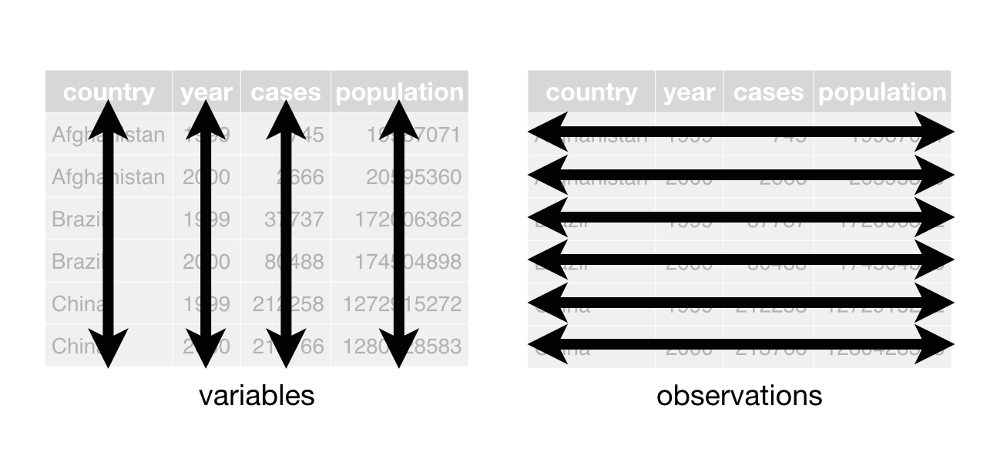

exclude: true

```{r, message=FALSE, warning=FALSE, include=FALSE}
options(
  htmltools.dir.version = FALSE, # for blogdown
  width=80
)

fansi::set_knit_hooks(knitr::knit_hooks)
options(crayon.enabled = TRUE)

library(magrittr)
```

---
class: middle
count: false

.center[
```{r echo=FALSE, out.width="50%"}
knitr::include_graphics('imgs/hex-tidyverse.png')
```
]

---

## Tidy data

```{r echo=FALSE, out.width="100%"}

```
* One variable per column
* One observation per row
* Each type of observational unit forms a table

.footnote[ From R4DS - [tidy data](r4ds.had.co.nz/tidy-data.html) ]


---
class: middle
count: false

.center[
```{r echo=FALSE, out.width="50%"}
knitr::include_graphics('imgs/hex-tibble.png')
```
]

---

## Modern data frames

Hadley Wickham / RStudio have a package that modifies data frames to be more modern, or as he calls them surly and lazy.

```{r}
library(tibble)
class(iris)
tbl_iris = as_tibble(iris)
class(tbl_iris)
```

---

## Fancy Printing

.font_small[
```{r}
tbl_iris
iris
```
]

---

.font_small[
```{r}
df = data.frame(x = rnorm(10,sd=5), y = rnorm(10), z = runif(10))
```

```{r}
as_tibble(df)
df
```
]

---

## Tibbles are lazy

```{r}
tbl_iris[1,]
```

--

.pull-left[
```{r}
tbl_iris[,"Species"]
```
]

--

.pull-right[
```{r}
tibble(
  x = 1:3, 
  y = c("A","B","C")
)
```
]

---

## More laziness

.pull-left[
```{r}
head( tbl_iris[1] )
```
]

--

.pull-right[
```{r}
head( tbl_iris[[1]] )
```
]

--

<br/>

.font_small[
```{r}
head( iris$Sp )
tbl_iris$Sp
head( tbl_iris$Species )
```
]


---

## Tibbles and length coercion

```{r error=TRUE}
tibble(x = 1:4, y = 1)
```

--

```{r error=TRUE}
tibble(x = 1:4, y = 1:2)
```

--

```{r error=TRUE}
tibble(x = 1:4, y = 1:3)
```


---

## Tibbles and S3

```{r}
d = tibble(
  x = 1:3, 
  y = c("A","B","C")
)

class(d)
```

--

<br/>

```{r}
class(d) = rev(class(d))
class(d)
d
```


---
class: middle
count: false

.center[
```{r echo=FALSE, out.width="50%"}
knitr::include_graphics('imgs/hex-magrittr.jpg')
```

# magrittr
]

---

## Pipes in R

You can think about the following sequence of actions - find key, unlock car, start car, drive to school, park.

<br/>

Expressed as a set of nested functions in R pseudocode this would look like:

```{r eval=FALSE}
park(drive(start_car(find("keys")), to="campus"))
```

<br/>

Writing it out using pipes give it a more natural (and easier to read) structure:

```{r eval=FALSE}
find("keys") %>%
    start_car() %>%
    drive(to="campus") %>%
    park()
```

---

## Approaches

All of the following are fine, it comes down to personal preference:

<br/>
Nested:
```{r, eval=FALSE}
h( g( f(x), y=1), z=1 )
```

<br/>
Piped:
```{r, eval=FALSE}
f(x) %>% g(y=1) %>% h(z=1)
```

<br/>
Intermediate:
```{r, eval=FALSE}
res = f(x)
res = g(res, y=1)
res = h(res, z=1)
```

---

## What about other arguments?

Sometimes we want to send our results to an function argument other than first one or we want to use the previous result for multiple arguments. In these cases we can refer to the previous result using `.`.

--

```{r}
data.frame(a = 1:3, b = 3:1) %>% lm(a~b, data=.)
```

--

```{r}
data.frame(a = 1:3, b = 3:1) %>% .[[1]]
```

--

```{r}
data.frame(a = 1:3, b = 3:1) %>% .[[length(.)]]
```


---
class: middle

.center[
```{r echo=FALSE, out.width="50%"}
knitr::include_graphics('imgs/hex-dplyr.png')
```
]

---

## A Grammar of Data Manipulation

dplyr is based on the concepts of functions as verbs that manipulate data frames.

Single data frame functions / verbs:

* `filter()` / `slice()`: pick rows based on criteria
* `select()` / `rename()`: select columns by name
* `pull()`: grab a column as a vector
* `arrange()`: reorder rows
* `mutate()` / `transmute()`: add new variables
* `distinct()`: filter for unique rows
* `sample_n()` / `sample_frac()`: randomly sample rows
* `summarise()` / `count()`: reduce variables to values
* `group_by()` / `ungroup()`: modify other verbs to act on subsets
* ... (many more)

---

## dplyr rules

1. First argument is *always* a data frame

2. Subsequent arguments say what to do with that data frame

3. *Always* return a data frame

4. Don't modify in place

5. Lazy evaluation magic


---

## Example Data

We will demonstrate dplyr's functionality using the nycflights13 data.

```{r message=FALSE}
library(dplyr)
library(nycflights13)

flights
```

---

## filter() - March flights

```{r}
flights %>% filter(month == 3)
```

---

## filter() - Flights in the first 7 days of March

```{r}
flights %>% filter(month == 3, day <= 7)
```

---

## filter() - Flights to LAX *or* JFK in March

```{r}
flights %>% filter(dest == "LAX" | dest == "JFK", month==3)
```

---

## slice() - First 10 flights

```{r}
flights %>% slice(1:10)
```

---

## slice() - Last 5 flights

```{r}
flights %>% slice((n()-4):n())
```

---

## select() - Individual Columns

```{r}
flights %>% select(year, month, day)
```

---

## select() - Exclude Columns

```{r}
flights %>% select(-year, -month, -day)
```

---

## select() - Ranges

```{r}
flights %>% select(year:day)
```

---

## select() - Exclusion Ranges

```{r}
flights %>% select(-(year:day))
```

---
class: split-50

## select() - Matching

```{r}
flights %>% select(contains("dep"), 
                   contains("arr"))
```

---

```{r}
flights %>% select(starts_with("dep"), 
                   starts_with("arr"))
```


Some other helpers (provide by tidyselect): 
.center[
  `starts_with`, `ends_with`, `everything`, `matches`, `num_range`, `one_of`, `everything`, `last_col`.
]

---

## select_if() - Get non-numeric columns

```{r}
flights %>% select_if(function(x) !is.numeric(x))
```


---

## rename() - Change column names

```{r}
flights %>% rename(tail_number = tailnum)
```
 
---

## select() vs. rename()

.small[
```{r}
flights %>% select(tail_number = tailnum)

flights %>% rename(tail_number = tailnum)
```
]

---

## pull()

```{r}
names(flights)

flights %>% pull("year") %>% head()

flights %>% pull(1) %>% head()

flights %>% pull(-1) %>% head()
```

---

## arrange() - Sort data

```{r}
flights %>% filter(month==3,day==2) %>% arrange(origin, dest)
```

---

## arrange() & desc() - Descending order

```{r}
flights %>% filter(month==3,day==2) %>% arrange(desc(origin), dest) %>% select(origin, dest, tailnum)
```

---

## mutate() - Modify columns

```{r message=FALSE}
flights %>% select(year:day) %>% mutate(date = paste(year,month,day,sep="/"))
```

---

## transmute() - Create new tibble from existing columns

```{r}
flights %>% select(year:day) %>% transmute(date = paste(year,month,day,sep="/"))
```

---

## distinct() - Find unique rows

```{r}
flights %>% select(origin, dest) %>% distinct() %>% arrange(origin,dest)
```

---

## Sampling rows

.small[
```{r}
flights %>% sample_n(10)

flights %>% sample_frac(0.00003)
```
]

---

## summarise()

```{r}
flights %>% summarize(n(), min(dep_delay), max(dep_delay))
```

--

```{r}
flights %>% 
  summarize(
    n = n(), 
    min_dep_delay = min(dep_delay, na.rm = TRUE), 
    max_dep_delay = max(dep_delay, na.rm = TRUE)
  )
```

---

## group_by()

```{r}
flights %>% group_by(origin)
```

---

## summarise() with group_by()

```{r}
flights %>% group_by(origin) %>%
  summarize(
    n = n(), 
    min_dep_delay = min(dep_delay, na.rm = TRUE), 
    max_dep_delay = max(dep_delay, na.rm = TRUE)
  )
```

---

```{r}
flights %>% group_by(origin, carrier) %>%
  summarize(
    n = n(), 
    min_dep_delay = min(dep_delay, na.rm = TRUE), 
    max_dep_delay = max(dep_delay, na.rm = TRUE)
  ) %>%
  filter(n > 10000)
```

---

## count()

.pull-left[
```{r}
flights %>% 
  group_by(origin, carrier) %>%
  summarize(n = n()) %>%
  ungroup()
```
]

.pull-right[
```{r}
flights %>% count(origin, carrier)
```
]

---

## mutate() with group_by()

```{r}
flights %>% group_by(origin) %>%
  mutate(
    n = n(), 
  ) %>%
  select(origin, n)
```

---

## Demos

1. How many flights to Los Angeles (LAX) did each of the legacy carriers (AA, UA, DL or US) have in May from JFK, and what was their average duration?

<br/>

2. What was the shortest flight out of each airport in terms of distance? In terms of duration?

---

## Exercise 1

1. Which plane (check the tail number) flew out of each New York airport the most?

<br/>

2. Which date should you fly on if you want to have the lowest possible average departure delay? What about arrival delay?

---
class: middle

.center[
```{r echo=FALSE, out.width="50%"}
knitr::include_graphics('imgs/hex-tidyr.png')
```
]

---

## Gather

```{r echo=FALSE, out.width="60%", fig.align="center"}
knitr::include_graphics('imgs/tidyr_gather.png')
```

.footnote[ From [data import cheatsheet](https://github.com/rstudio/cheatsheets/blob/master/data-import.pdf) ]

---

## Spread

```{r echo=FALSE, out.width="70%", fig.align="center"}
knitr::include_graphics('imgs/tidyr_spread.png')
```

.footnote[ From [data import cheatsheet](https://github.com/rstudio/cheatsheets/blob/master/data-import.pdf) ]

---

## Separate

```{r echo=FALSE, out.width="70%", fig.align="center"}
knitr::include_graphics('imgs/tidyr_separate.png')
```

.footnote[ From [data import cheatsheet](https://github.com/rstudio/cheatsheets/blob/master/data-import.pdf) ]

---

## Unite

```{r echo=FALSE, out.width="70%", fig.align="center"}
knitr::include_graphics('imgs/tidyr_unite.png')
```

.footnote[ From [data import cheatsheet](https://github.com/rstudio/cheatsheets/blob/master/data-import.pdf) ]

---

## Example 1 - Grades

Is the following data tidy?

```{r}
(grades = tibble(
  name  = c("Alice", "Bob", "Carol", "Dave"),
  hw_1   = c(19, 18, 18, 19),
  hw_2   = c(19, 20, 20, 19),
  hw_3   = c(18, 18, 18, 18),
  hw_4   = c(20, 16, 17, 19),
  exam_1 = c(89, 77, 96, 86),
  exam_2 = c(95, 88, 99, 82)
))
```

--

How would we calculate a final score based on the following formula,
$$\text{score} = 0.6\,\frac{\sum\text{hw}_i}{80} + 0.4\,\frac{\sum\text{exam}_j}{200}$$

---

## Semi-tidy approach

```{r}
grades %>%
  mutate(
    hw_avg = (hw_1+hw_2+hw_3+hw_4)/4,
    exam_avg = (exam_1+exam_2)/2
  ) %>%
  mutate(
    overall = 0.4*(exam_avg/100) + 0.6*(hw_avg/20)
  )
```

---

## Wide -> Long (`pivot_longer`)

```{r}
tidyr::pivot_longer(grades, cols = hw_1:exam_2, 
                    names_to = "assignment", 
                    values_to = "score")
```

---

```{r}
tidyr::pivot_longer(grades, cols = hw_1:exam_2, 
                    names_to = c("type", "id"), names_sep = "_", 
                    values_to = "score")
```


---

## Tidy approach?

```{r}
grades %>%
  tidyr::pivot_longer(
    cols = hw_1:exam_2, 
    names_to = c("type", "id"), names_sep = "_", 
    values_to = "score"
  ) %>% 
  group_by(name, type) %>%
  summarize(total = sum(score))
```

---

## Long -> Wide (`pivot_wider`)

```{r}
grades %>%
  tidyr::pivot_longer(
    cols = hw_1:exam_2, 
    names_to = c("type", "id"), names_sep = "_", 
    values_to = "score"
  ) %>% 
  group_by(name, type) %>%
  summarize(total = sum(score)) %>%
  tidyr::pivot_wider(
    names_from = type, values_from = total
  )
```

---

## Finishing up

```{r}
grades %>%
  tidyr::pivot_longer(
    cols = hw_1:exam_2, 
    names_to = c("type", "id"), names_sep = "_", 
    values_to = "score"
  ) %>% 
  group_by(name, type) %>%
  summarize(total = sum(score)) %>%
  tidyr::pivot_wider(
    names_from = type, values_from = total
  ) %>%
  mutate(
    score = 0.6*(hw/80) + 0.4*(exam/200)
  )
```


