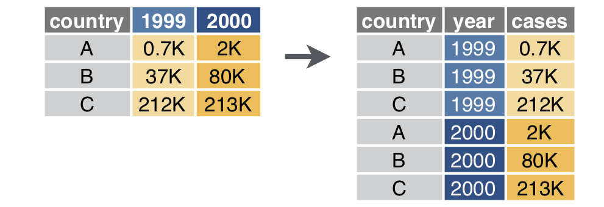
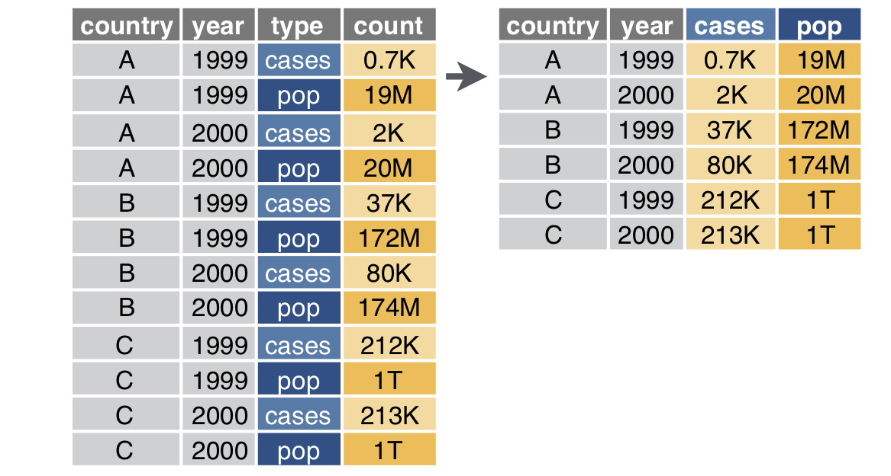
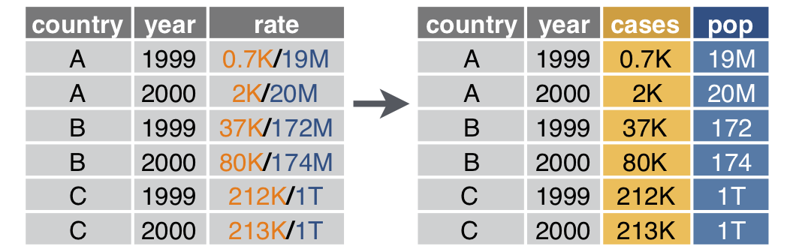
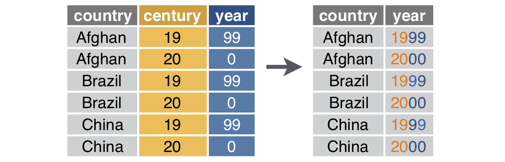

exclude: true

```{r setup, message=FALSE, warning=FALSE, include=FALSE}
options(
  htmltools.dir.version = FALSE, # for blogdown
  width=80
)

fansi::set_knit_hooks(knitr::knit_hooks)
options(crayon.enabled = TRUE)

library(tibble)
library(tidyr)
library(purrr)
library(dplyr)
library(magrittr)
library(repurrrsive)
```


---
class: middle

.center[
```{r echo=FALSE, out.width="50%"}
knitr::include_graphics('imgs/hex-tidyr.png')
```
]

---

## Example - Grades

Is the following data tidy?

```{r}
(grades = tibble(
  name  = c("Alice", "Bob", "Carol", "Dave"),
  hw_1   = c(19, 18, 18, 19),
  hw_2   = c(19, 20, 20, 19),
  hw_3   = c(18, 18, 18, 18),
  hw_4   = c(20, 16, 17, 19),
  exam_1 = c(89, 77, 96, 86),
  exam_2 = c(95, 88, 99, 82)
))
```

--

<br/><br/>

.center[
This is an example of *wide* data, which is almost never *tidy*.
]

---

## Updating `tidyr`

The current version of tidyr installed in Noteable is slightly out of date (v0.8.3 vs v1.0.0). To fix this run the following,

```{r eval=FALSE}
lib = Sys.getenv("R_LIBS_USER")
dir.create(lib, recursive=TRUE, showWarnings=FALSE)
install.packages("tidyr", lib=lib)
```

```{r fig.align="center", out.width="66%", echo=FALSE}

```


---

## Wider <-> Longer

```{r fig.align="center", out.width="66%", echo=FALSE}

```

.footnote[ From Mara Averick's [tidyexplain](https://github.com/batpigandme/tidyexplain/tree/pivot) repo]

---

```{r fig.align="center", out.width="100%", echo=FALSE}

```

---

## `pivot_longer`

```{r include=FALSE}
table = tribble(
  ~country, ~"1999",  ~"2000",
  "A",       "0.7K",     "2K",
  "B",        "37K",    "80K",
  "C",       "212K",   "213K"
)
```

```{r eval=FALSE}
pivot_longer(table, cols = -country, names_to = "year", values_to = "cases")
```

```{r echo=FALSE, out.width="60%", fig.align="center"}

```


---

## `pivot_wider`

```{r include=FALSE}
table = tribble(
  ~country, ~year,  ~type, ~count,
  "A", 1999, "cases", "0.7K",
  "A", 1999, "pop",   "19M",
  "A", 2000, "cases", "2K",
  "A", 2000, "pop",   "20M",
  "B", 1999, "cases", "37K",
  "B", 1999, "pop",   "172M",
  "B", 2000, "cases", "80K",
  "B", 2000, "pop",   "174M",
  "C", 1999, "cases", "212K",
  "C", 1999, "pop",   "1T",
  "C", 2000, "cases", "213K",
  "C", 2000, "pop",   "1T"
)
```

```{r eval=FALSE}
pivot_wider(table, id_cols = country:year, names_from = type, values_from = count)
```

```{r echo=FALSE, out.width="70%", fig.align="center"}

```


---

## Separate

```{r eval=FALSE}
separate(table, col = rate, sep = "/", into = c("cases", "pop"))
```

```{r echo=FALSE, out.width="70%", fig.align="center"}

```

---

## Unite

```{r eval=FALSE}
unite(table, century, year, col = "year", sep = "")
```

```{r echo=FALSE, out.width="70%", fig.align="center"}

```

---

## Example 1 - Summarizing Grades

Is the following data tidy?

```{r}
(grades = tibble(
  name  = c("Alice", "Bob", "Carol", "Dave"),
  hw_1   = c(19, 18, 18, 19),
  hw_2   = c(19, 20, 20, 19),
  hw_3   = c(18, 18, 18, 18),
  hw_4   = c(20, 16, 17, 19),
  exam_1 = c(89, 77, 96, 86),
  exam_2 = c(95, 88, 99, 82)
))
```

--

How would we calculate a final score based on the following formula,
$$\text{score} = 0.6\,\frac{\sum\text{hw}_i}{80} + 0.4\,\frac{\sum\text{exam}_j}{200}$$

---

## Semi-tidy approach

```{r}
grades %>%
  mutate(
    hw_avg = (hw_1+hw_2+hw_3+hw_4)/4,
    exam_avg = (exam_1+exam_2)/2
  ) %>%
  mutate(
    overall = 0.4*(exam_avg/100) + 0.6*(hw_avg/20)
  )
```

--

<br/><br/>

.center[
What is problematic about this approach?
]

---

## Wide -> Long (`pivot_longer`)

```{r}
tidyr::pivot_longer(grades, cols = hw_1:exam_2, 
                    names_to = "assignment", 
                    values_to = "score")
```

---

```{r}
tidyr::pivot_longer(grades, cols = hw_1:exam_2, 
                    names_to = c("type", "id"), names_sep = "_", 
                    values_to = "score")
```


---

## Tidy approach?

```{r}
grades %>%
  tidyr::pivot_longer(
    cols = hw_1:exam_2, 
    names_to = c("type", "id"), names_sep = "_", 
    values_to = "score"
  ) %>% 
  group_by(name, type) %>%
  summarize(total = sum(score))
```

---

## Long -> Wide (`pivot_wider`)

```{r}
grades %>%
  tidyr::pivot_longer(
    cols = hw_1:exam_2, 
    names_to = c("type", "id"), names_sep = "_", 
    values_to = "score"
  ) %>% 
  group_by(name, type) %>%
  summarize(total = sum(score)) %>%
  tidyr::pivot_wider(
    names_from = type, values_from = total
  )
```

---

## Finishing up

```{r}
grades %>%
  tidyr::pivot_longer(
    cols = hw_1:exam_2, 
    names_to = c("type", "id"), names_sep = "_", 
    values_to = "score"
  ) %>% 
  group_by(name, type) %>%
  summarize(total = sum(score)) %>%
  tidyr::pivot_wider(
    names_from = type, values_from = total
  ) %>%
  mutate(
    score = 0.6*(hw/80) + 0.4*(exam/200)
  )
```


---
class: middle
count: false

# Functional Programming

---
class: middle
count: false

# Apply functions

---

## Apply functions

The apply functions are a collection of tools for functional programming in R, they are variations of the `map` function found in many other languages

```{r, eval=FALSE}
??apply
---

## 
## Help files with alias or concept or title matching ‘apply’ using fuzzy
## matching:
## 
## base::apply             Apply Functions Over Array Margins
## base::.subset           Internal Objects in Package 'base'
## base::by                Apply a Function to a Data Frame Split by Factors
## base::eapply            Apply a Function Over Values in an Environment
## base::lapply            Apply a Function over a List or Vector
## base::mapply            Apply a Function to Multiple List or Vector Arguments
## base::rapply            Recursively Apply a Function to a List
## base::tapply            Apply a Function Over a Ragged Array
```

---

## lapply

Usage: `lapply(X, FUN, ...)`

`lapply` returns a list of the same length as `X`, each element of which is the result of applying `FUN` to the corresponding element of `X`.

<br/>

.pull-left[
```{r}
lapply(1:8, sqrt) %>% str()
```
]

.pull-right[
```{r}
lapply(1:8, function(x) (x+1)^2) %>% str()
```
]

---

```{r}
lapply(1:8, function(x, pow) x^pow, pow=3) %>% str()
lapply(1:8, function(x, pow) x^pow, x=2) %>% str()
```

---

## sapply

Usage: `sapply(X, FUN, ..., simplify = TRUE, USE.NAMES = TRUE)`

`sapply` is a *user-friendly* version and wrapper of `lapply`, it is a *simplifying* version of lapply. Whenever possible it will return a vector, matrix, or an array.

<br/>

```{r}
sapply(1:8, sqrt)
sapply(1:8, function(x) (x+1)^2)
```

---

```{r}
sapply(1:8, function(x) c(x, x^2, x^3, x^4))
sapply(1:8, function(x) list(x, x^2, x^3, x^4))
```

---

```{r}
sapply(2:6, seq)
```

---

## [ls]apply and data frames

We can use these functions with data frames, the key is to remember that a data frame is just a fancy list.

```{r}
df = data.frame(a = 1:6, b = letters[1:6], c = c(TRUE,FALSE))
lapply(df, class) %>% str()
sapply(df, class)
```

---

## other less common applies

* `apply(X, MARGIN, FUN, ...)` - applies a function over the rows or columns of a data frame, matrix or array

* `vapply(X, FUN, FUN.VALUE, ..., USE.NAMES = TRUE)` - is similar to `sapply`, but has a enforced return type and size

* `mapply(FUN, ..., MoreArgs = NULL, SIMPLIFY = TRUE, USE.NAMES = TRUE)` -  like `sapply` but will iterate over multiple vectors at the same time.

* `rapply(object, f, classes = "ANY", deflt = NULL, how = c("unlist", "replace", "list"), ...)` - a recursive version of `lapply`, behavior depends largely on the `how` argument

* `eapply(env, FUN, ..., all.names = FALSE, USE.NAMES = TRUE)` -  apply a function over an environment.

---

## Exercise 1

Using the `sw_people` data set in the `repurrrsive` package, extract the names of all of the characters using:

* a for loop

* one of the apply functions


Start by examining the structure of the data using RStudio's viewer,
```{r eval=FALSE}
library(repurrrsive)
View(sw_people)
```

---
class: middle

.center[
```{r echo=FALSE, out.width="50%"}
knitr::include_graphics('imgs/hex-purrr.png')
```
]

---

## Map functions

Basic functions for looping over an object and returning a value (of a specific type) - replacement for `lapply`/`sapply`/`vapply`.

* `map()` - returns a list.

* `map_lgl()` - returns a logical vector.

* `map_int()` - returns a integer vector.

* `map_dbl()` - returns a double vector.

* `map_chr()` - returns a character vector.

* `map_dfr()` - returns a data frame by row binding.

* `map_dfc()` - returns a data frame by column binding.

* `walk()` - returns nothing, call function exclusively for its side effects


---

## Type Consistency

R is a weakly / dynamically typed language which means there is no simple way to define a function which enforces the argument or return types. This flexibility can be useful at times, but often it makes it hard to reason about your code and requires more verbose code to handle edge cases.

```{r}
x = list(rnorm(1e3),rnorm(1e3),rnorm(1e3))
```
```{r}
map_dbl(x, mean)
```
```{r}
map_chr(x, mean)
```
```{r error=TRUE}
map_int(x, mean)
```

---

## Shortcut - Anonymous Functions

An anonymous function is one that is never given a name (assigned to a variable)

```{r}
sapply(1:5, function(x) x^(x+1))
```

purrr lets us write anonymous functions using one sided formulas where the argument is given by `.` or `.x` for `map` and related functions.

```{r}
map_dbl(1:5, ~ .^(.+1))
```

```{r}
map_dbl(1:5, ~ .x^(.x+1))
```

---

## Shortcut - Anonymous Functions - `map2`

Functions with the `map2` prefix work the same as the `map` functions but they iterate over two objects instead of one. Arguments in an anonymous function are instead given by `.x` and `.y` (or `..1` and `..2`) respectively.

```{r}
map2_dbl(1:5, 1:5, ~ .x^(.y+1))

map2_dbl(1:5, 1:5, ~ ..1^(..2+1))

map2_chr(letters[1:5], LETTERS[1:5], paste0)
```

---

## Purrr shortcut - Lookups

Very often we want to extract only certain (named) values from a list, `purrr` provides a shortcut for this operation when you provide either a character or numeric value instead of a function to apply.


```{r}
x = list(list(a=1L,b=2L,c=list(d=3L,e=4L)),
         list(a=5L,b=6L,c=list(d=7L,e=8L,f=9L)))
```     

--

.pull-left[
```{r}
map_int(x, "a")
map_dbl(x, c("c","e"))
map_chr(x, list(3,"d"))
```
]

--

.pull-right[
```{r}
map_df(x, 3)
map_dfc(x, 3)
```
]


---

```{r}
x = list(list(a=1L,b=2L,c=list(d=3L,e=4L)),
         list(a=5L,b=6L,c=list(d=7L,e=8L,f=9L)))
``` 

```{r error=TRUE}
map(x, list(3,"f"))

map_int(x, list(3,"f"))

map_int(x, list(3,"f"), .default=NA)
```

---

## Exercise 2

Using the `sw_people` data set again, generate a tidy data frame (tibble) containing as many details as possible.

---

## list columns

```{r}
d = tibble(
  name = purrr::map_chr(sw_people, "name"),
  starships = purrr::map(sw_people, "starships")
)

d
```

---

```{r}
d %>%
  mutate(
    n_starships = purrr::map_int(starships, length)
  )
```

---
class: middle

.center[
```{r echo=FALSE, out.width="25%"}
knitr::include_graphics('imgs/hex-tidyr.png')
```
 and 
```{r echo=FALSE, out.width="25%"}
knitr::include_graphics('imgs/hex-purrr.png')
```
]

---

## Tidy data from nested lists

The recent version of `tidyr` have added several functions that are designed to aide in the tidying of heirachical data. Since they are part of `tidyr` all of the following functions work with data frames.

From `tidyr`

> `hoist()`, `unnest_longer()`, and `unnest_wider()` provide tools for rectangling, collapsing deeply nested lists into regular columns.

---

```{r}
(d = tibble(people=sw_people))
```

--

```{r}
unnest_wider(d, people)
```

---

```{r}
unnest_longer(d, people)
```

---

```{r}
unnest_wider(d, people) %>% 
  select(name, starships) %>%
  unnest_longer(starships, )
```

---

```{r}
tibble(people = sw_people) %>%
  hoist(
    people,
    name = "name",
    height = "height",
    mass = "mass",
    primary_starship = list("starships", 1)
  )
```

---
class: middle
count: false

# Acknowledgments

---

## Acknowledgments

Above materials are derived in part from the following sources:

* Hadley Wickham - [Adv-R Functionals](http://adv-r.had.co.nz/Functionals.html)

* Hadley Wickham - [R for Data Science](http://r4ds.had.co.nz/)

* Neil Saunders - [A brief introduction to "apply" in R](http://nsaunders.wordpress.com/2010/08/20/a-brief-introduction-to-apply-in-r/)

* Jenny Bryan - [Purrr Tutorial](https://jennybc.github.io/purrr-tutorial/)

* [R Language Definition](http://stat.ethz.ch/R-manual/R-devel/doc/manual/R-lang.html)


