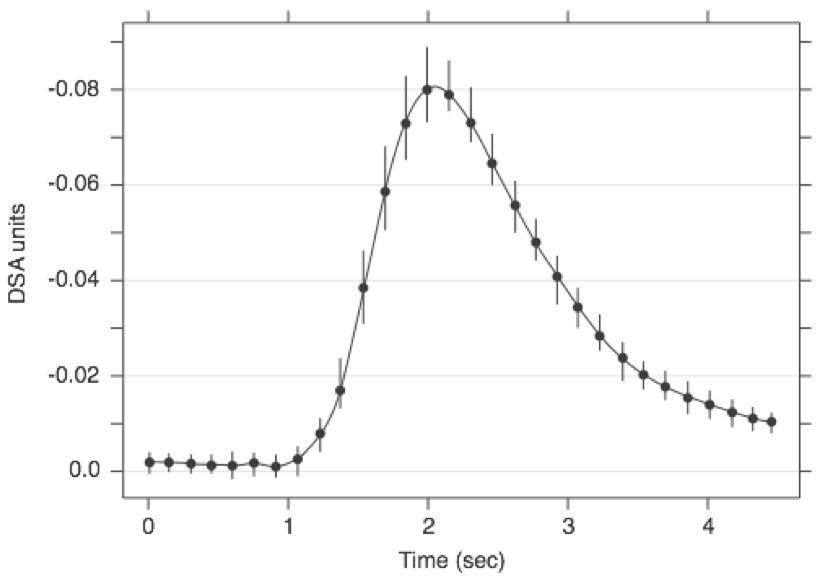
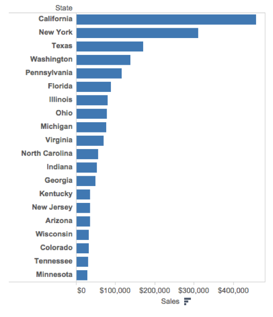
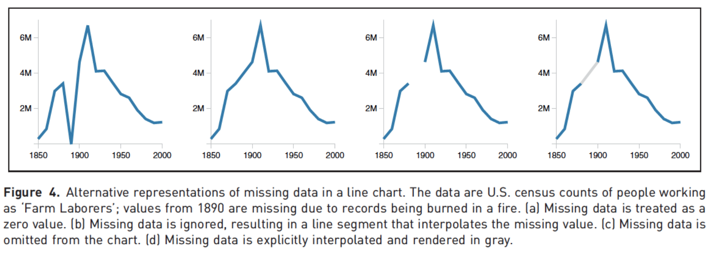

exclude: true

```{r setup, message=FALSE, warning=FALSE, include=FALSE}
options(
  htmltools.dir.version = FALSE, # for blogdown
  width = 110,
  tibble.width = 110
)

knitr::opts_chunk$set(
  fig.align = "center",
  cache = TRUE
)

library(tidyverse)
```

---
class: middle

```{r echo=FALSE, out.width="50%"}
knitr::include_graphics("imgs/hex-ggplot2.png")
```
---

## The Grammar of Graphics

- Visualisation concept created by Leland Wilkinson (1999)
    - to define the basic elements of a statistical graphic 

- Adapted for R by Hadley Wickham (2009)
    - consistent and compact syntax to describe statistical graphics
    - highly modular as it breaks up graphs into semantic components 

- It is not meant as a guide to which graph to use and how to best convey your data (more on that later).

---

## Terminology

A statistical graphic is a...

- mapping of **data**
- which may be **statistically transformed** (summarised, log-transformed, etc.)
- to **aesthetic attributes** (color, size, xy-position, etc.)
- using **geometric objects** (points, lines, bars, etc.)
- and mapped onto a specific **facet** and **coordinate system**

---

## Anatomy of a ggplot call

```r
ggplot(
  data = [dataframe], 
  mapping = aes(
    x = [var_x], y = [var_y], 
    color = [var_for_color], 
    shape = [var_for_shape],
    ...
  )
) +
  geom_[some_geom](
    mapping = aes(
      color = [var_for_geom_color],
      ...
    )
  ) +
  ... # other geometries
  scale_[some_axis]_[some_scale]() +
  facet_[some_facet]([formula]) +
  ... # other options
```

---

## Diamonds

```{r}
set.seed(20191014)
diamonds = sample_n(ggplot2::diamonds, 1000)
diamonds
```

--

<br/>

```{r}
head(diamonds$cut)
head(diamonds$color)
```

---

## Example 1

```{r echo=FALSE, fig.height=5, fig.width=7, warning=FALSE}
ggplot(data = diamonds, aes(x = carat, y = price)) +
  geom_point()
```

.midi[
- Which data are used as an input?
- Are the variables statistically transformed before plotting?
- What geometric objects are used to represent the data?
- What variables are mapped onto which aesthetic attributes?
- What type of scales are used to map data to aesthetics?
]

---

```{r fig.height=5, fig.width=7}
ggplot(data = diamonds, aes(x = carat, y = price)) +
  geom_point()
```

---

## Altering aesthetics

```{r echo=FALSE, fig.height=5, fig.width=7, warning=FALSE}
ggplot(data = diamonds, aes(x = carat, y = price)) +
  geom_point(alpha = 0.25, color = "blue")
```

.midi[
- How did the plot change?
- Are these changes based on data or are the changes based on stylistic choices for the geometric objects?
]

---

```{r fig.height=5, fig.width=7, warning=FALSE}
ggplot(data = diamonds, aes(x = carat, y = price)) +
  geom_point(alpha = 0.25, color = "blue")
```

---

## Example 2

```{r echo=FALSE, fig.height=5, fig.width=7}
ggplot(data = diamonds, aes(x = carat, y = sqrt(price), color = color)) +
  geom_point()
```

.midi[
- Which data are used as an input?
- Are the variables statistically transformed before plotting?
- What geometric objects are used to represent the data?
- What variables are mapped onto which aesthetic attributes?
- What type of scales are used to map data to aesthetics?
]

---

```{r, fig.height=5, fig.width=7}
ggplot(data = diamonds, aes(x = carat, y = sqrt(price), color = color)) +
  geom_point()
```

---

## Example 3

```{r echo=FALSE, fig.height=5, fig.width=7}
ggplot(data = diamonds, aes(x = carat, y = sqrt(price), color = table)) +
  geom_point()
```

.midi[
- Which data are used as an input?
- Are the variables statistically transformed before plotting?
- What geometric objects are used to represent the data?
- What variables are mapped onto which aesthetic attributes?
- What type of scales are used to map data to aesthetics?
]

---

```{r, fig.height=5, fig.width=7}
ggplot(data = diamonds, aes(x = carat, y = sqrt(price), color = table)) +
  geom_point()
```

---

## Example 4

```{r echo=FALSE, fig.height=5, fig.width=10}
ggplot(data = diamonds, aes(x = cut, y = price, fill = color)) +
  geom_boxplot() +
  scale_y_log10()
```

.midi[
- Which data are used as an input?
- Are the variables statistically transformed before plotting?
- What geometric objects are used to represent the data?
- What variables are mapped onto which aesthetic attributes?
- What type of scales are used to map data to aesthetics?
]

---

```{r fig.height=5, fig.width=10}
ggplot(data = diamonds, aes(x = cut, y = price, fill = color)) +
  geom_boxplot() +
  scale_y_log10()
```

---

```{r fig.height=5, fig.width=10}
ggplot(data = diamonds, aes(x = cut, y = log(price,10), fill = color)) +
  geom_boxplot() +
  scale_y_continuous()
```

---

## Example 5

```{r echo=FALSE, fig.height=5, fig.width=10}
ggplot(data = diamonds, aes(x = cut, fill=color)) +
  geom_bar(position = "dodge", color = "black") +
  coord_flip() +
  scale_fill_brewer(palette = "Blues")
```

.midi[
- Which data are used as an input?
- Are the variables statistically transformed before plotting?
- What geometric objects are used to represent the data?
- What variables are mapped onto which aesthetic attributes?
- What type of scales are used to map data to aesthetics?
]

---

```{r, fig.height=5, fig.width=10}
ggplot(data = diamonds, aes(x = cut, fill=color)) +
  geom_bar(position = "dodge", color = "black") +
  coord_flip() +
  scale_fill_brewer(palette = "Blues")
```

---

## Example 6

```{r echo=FALSE, fig.height=5, fig.width=10}
ggplot(data = ggplot2::diamonds, aes(x = price/carat, fill=color)) +
  geom_density(alpha=0.5) +
  facet_grid(rows = vars(color), cols = vars(cut)) +
  scale_x_sqrt() + 
  labs(x = "Price per carat")
```

.midi[
- Which data are used as an input?
- Are the variables statistically transformed before plotting?
- What geometric objects are used to represent the data?
- What variables are mapped onto which aesthetic attributes?
- What type of scales are used to map data to aesthetics?
]

---

```{r fig.height=5, fig.width=10}
ggplot(data = ggplot2::diamonds, aes(x = price/carat, fill=color)) +
  geom_density(alpha=0.5) +
  facet_grid(rows = vars(color), cols = vars(cut)) +
  scale_x_sqrt() + 
  labs(x = "Price per carat")
```

---

## More `ggplot2` resources

- Visit https://ggplot2.tidyverse.org/ for ggplot2 documentation and helpful articles. Reference section contains lots of examples for each geometry type.

- Refer to the [`ggplot2` cheatsheet](https://github.com/rstudio/cheatsheets/blob/master/data-visualization-2.1.pdf)

- Book - [ggplot2: Elegant Graphics for Data Analysis](https://ggplot2-book.org/)

---

## ggplot objects

```{r cache=TRUE}
g = ggplot(diamonds, aes(x = carat, y = price)) + geom_point()
class(g)
```

--

.pull-left[
```{r}
g
```
]

.pull-right[
```{r message=FALSE}
g + geom_smooth(se=FALSE)
```
]

---

## Exercise 1

```{r echo=FALSE, fig.height=5, fig.width=10, message=FALSE}
diamonds %>%
  filter(carat < 4) %>%
  ggplot(aes(x=carat, y=price, color = cut)) +
    geom_point() +
    geom_smooth(se=FALSE, color="black") +
    scale_y_sqrt()
```

Note the presence, or lack thereof, of any outliers.

---

## Exercise 2

```{r echo=FALSE, fig.height=5, fig.width=10, message=FALSE}
diamonds %>% 
  ggplot(aes(x=clarity, fill=color)) +
    geom_bar(color="black") +
    coord_flip() +
    facet_wrap(vars(cut)) +
    scale_fill_brewer(palette = "Blues")
```

---
class: middle

```{r echo=FALSE, fig.align="center", out.width="30%"}
knitr::include_graphics("imgs/patchwork_logo.png")
```

.footnote[
`remotes::install_github("thomasp85/patchwork")`
]
---

## Plots

```{r cache=TRUE}
library(patchwork)

p1 = ggplot(diamonds) + geom_point(aes(x = carat, y = price))

p2 = ggplot(diamonds) + geom_boxplot(aes(x = cut, y = price))

p3 = ggplot(diamonds) + geom_boxplot(aes(x = color, y = price))

p4 = ggplot(diamonds) + geom_boxplot(aes(x = clarity, y = price))
```

---

```{r fig.width=10}
p1 + p2 + p3 + p4
```

---

```{r fig.width=10}
p1 + p2 + p3 + p4 + plot_layout(nrow=1)
```

---

```{r fig.width=10}
p1 / (p2 + p3 + p4)
```

---

```{r fig.width=10}
p1 + {
  p2 + {
    p3 + p4 + plot_layout(ncol = 1)
  }
} + plot_layout(ncol = 1)
```

---

```{r fig.width=10}
p1 + p2 + p3 + p4 + plot_annotation(title = "Diamonds data", tag_levels = c("A","1"))
```

---
class: center, middle

# Why do we visualize?

---

## Asncombe's Quartet

```{r}
datasets::anscombe %>% as_tibble()
```

---

## Tidy anscombe

.midi[
```{r}
(tidy_anscombe = datasets::anscombe %>%
  pivot_longer(everything(), names_sep = 1, names_to = c("var", "group")) %>%
  pivot_wider(id_cols = group, names_from = var, 
              values_from = value, values_fn = list(value = list)) %>% 
  unnest(cols = c(x,y)))
```
]

--

.midi[
```{r}
tidy_anscombe %>%
  group_by(group) %>%
  summarize(mean_x = mean(x), mean_y = mean(y), sd_x = sd(x), sd_y = sd(y), cor = cor(x,y))
```
]

---

```{r fig.width=7}
ggplot(tidy_anscombe, aes(x = x, y = y, color = as.factor(group))) +
  geom_point(size=2) +
  facet_wrap(vars(group)) +
  geom_smooth(method="lm", se=FALSE, fullrange=TRUE) +
  guides(color=FALSE)
```

---

## DatasauRus

.pull-left33[
```{r}
datasauRus::datasaurus_dozen
```
]

--

.pull-right66[
```{r}
datasauRus::datasaurus_dozen %>%
  group_by(dataset) %>%
  summarize(mean_x = mean(x), mean_y = mean(y), 
            sd_x = sd(x), sd_y = sd(y), 
            cor = cor(x,y))
```
]

---

```{r}
ggplot(datasauRus::datasaurus_dozen, aes(x = x, y = y, color = dataset)) +
  geom_point() +
  facet_wrap(vars(dataset)) +
  guides(color=FALSE)
```

---

## Simpson's Paradox

```{r include=FALSE}
datasauRus::simpsons_paradox %>%
  ggplot(aes(x=x, y=y, color=dataset)) +
    geom_point() +
    facet_wrap(vars(dataset))

ctrs = matrix(
  c(
    25,15,
    38,29,
    48,58,
    59,75,
    80,83
  ),
  byrow=TRUE,
  ncol=2
)

simpsons = datasauRus::simpsons_paradox %>%
  filter(dataset == "simpson_2", x < 75) %>%
  select(-dataset) %>%
  mutate(., group = kmeans(., ctrs)$cluster %>% as.character()) 
```

.pull-left[
```{r echo=FALSE} 
simpsons %>%
  ggplot(aes(x=x, y=y)) +
    geom_point() +
    geom_smooth(method="lm", se=FALSE, color="black")
```
]

--

.pull-right[
```{r echo = FALSE} 
simpsons %>%
  ggplot(aes(x=x, y=y, color=group)) +
    geom_point() +
    geom_smooth(method="lm", se=FALSE) +
    geom_smooth(method="lm", se=FALSE, color="black") +
    guides(color = FALSE)
```
]


---
class: center, middle

# Designing effective visualizations

---

## Keep it simple

<br/> <br/> <br/>

.pull-left[
```{r pie-3d, echo=FALSE, out.width=300}
knitr::include_graphics("imgs/pie-3d.jpg")
```
]

.pull-right[
```{r pie-to-bar, echo=FALSE, out.width=500}
d <- tribble(
  ~category,                     ~value,
  "Cutting tools"                , 0.03,
  "Buildings and administration" , 0.22,
  "Labor"                        , 0.31,
  "Machinery"                    , 0.27,
  "Workplace materials"          , 0.17
)
ggplot(d, aes(x = fct_reorder(category, value), y = value)) +
  geom_col() +
  theme_minimal() +
  coord_flip() +
  labs(x = "", y = "")
```
]

---

## Use color	to	draw	attention

<br/> <br/>

.pull-left[
```{r echo=FALSE, out.width=500}
d %>%
  mutate(category = str_replace(category, " ", "\n")) %>%
  ggplot(aes(x = category, y = value, fill = category)) +
    geom_col() +
    theme_minimal() +
    labs(x = "", y = "") +
    theme(legend.position = "none")
```
]

.pull-right[
```{r echo=FALSE, out.width=600}
ggplot(d, aes(x = fct_reorder(category, value), y = value, fill = category)) +
  geom_col() +
  theme_minimal() +
  coord_flip() +
  labs(x = "", y = "") +
  scale_fill_manual(values = c("red", rep("gray", 4))) +
  theme(legend.position = "none")
```
]

---

## Tell a story

```{r echo=FALSE, fig.align="center", out.width=800}
knitr::include_graphics("imgs/time-series.story.png")
```

.footnote[
*Credit*: Angela Zoss and Eric Monson, Duke DVS
]

---

## Leave out non-story details

<br/> <br/>

.pull-left[
```{r echo=FALSE, fig.align="center", out.width=500}

```
]

.pull-right[
```{r echo=FALSE, fig.align="center", out.width=500}

```
]


.footnote[
*Credit*: Angela Zoss and Eric Monson, Duke DVS
]

---

## Order / usage matters

<br/> <br/>

.pull-left[
```{r echo=FALSE, fig.align="center", out.width=350}
knitr::include_graphics("imgs/vis_order1.png")
```
]


.pull-right[
```{r echo=FALSE, fig.align="center", out.width=350}

```
]


.footnote[
*Credit*: Angela Zoss and Eric Monson, Duke DVS
]

---

## Be clear about missing data

<br/><br/>

```{r echo=FALSE, fig.align="center", out.width="100%"}

```

.footnote[
http://ivi.sagepub.com/content/10/4/271 <br/>
Angela Zoss and Eric Monson, Duke DVS
]


---

## Reduce cognitive burden

<br/> <br/>

```{r echo=FALSE, fig.align="center", out.width="100%"}
knitr::include_graphics("imgs/vis_text.png")
```

.footnote[
http://www.storytellingwithdata.com/2012/09/some-finer-points-of-data-visualization.html <br/>
Angela Zoss and Eric Monson, Duke DVS
]

---

## Use descriptive titles

<br/> <br/>

```{r echo=FALSE, fig.align="center", out.width="100%"}

```


.footnote[
*Credit*: Angela Zoss and Eric Monson, Duke DVS
]

---

## Annotate figures directly

<br/> <br/>

```{r echo=FALSE, fig.align="center", out.width="100%"}
knitr::include_graphics("imgs/vis_annotate.png")
```


.footnote[
https://bl.ocks.org/susielu/23dc3082669ee026c552b85081d90976
]

---

## All of the data doesn't tell a story

<br/>

```{r echo=FALSE, fig.align="center", out.width="80%"}
knitr::include_graphics("imgs/vis_nyt1.png")
```


.footnote[
http://www.nytimes.com/interactive/2014/06/05/upshot/how-the-recession-reshaped-the-economy-in-255-charts.html
]

---

## All of the data doesn't tell a story

<br/>

```{r echo=FALSE, fig.align="center", out.width="80%"}
knitr::include_graphics("imgs/vis_nyt2.png")
```


.footnote[
http://www.nytimes.com/interactive/2014/06/05/upshot/how-the-recession-reshaped-the-economy-in-255-charts.html
]

---

## All of the data doesn't tell a story

<br/>

```{r echo=FALSE, fig.align="center", out.width="80%"}

```


.footnote[
http://www.nytimes.com/interactive/2014/06/05/upshot/how-the-recession-reshaped-the-economy-in-255-charts.html
]

---
class: middle, center

# Chart Remakes / Makeovers

---

## The Why Axis - BLS


```{r echo=FALSE, fig.align="center", out.width="80%"}

```

.footnote[
http://thewhyaxis.info/defaults/
]

---

## The Why Axis - Gender Gap

<br/>

```{r echo=FALSE, fig.align="center", out.width="60%"}

```

.footnote[
http://thewhyaxis.info/gap-remake/
]

---
class: middle, center

# Acknowledgments

---

## Acknowledgments

Above materials are derived in part from the following sources:

* Hadley Wickham - [R for Data Science](http://r4ds.had.co.nz/) & [Elegant Graphics for Data Analysis](https://ggplot2-book.org)

* [ggplot2 website](https://ggplot2.tidyverse.org/)

* Visualization training materials developed by Angela Zoss and Eric Monson, [Duke DVS](http://libcms.oit.duke.edu/data/)


